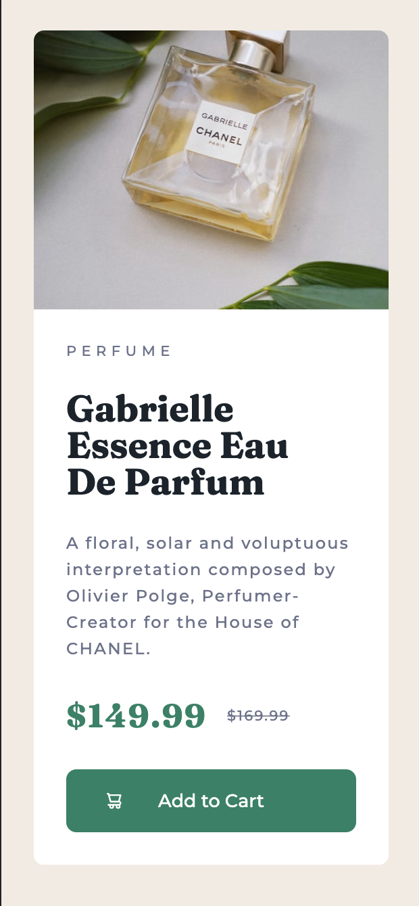

# Frontend Mentor - Product preview card component solution

This is a solution to the [Product preview card component challenge on Frontend Mentor](https://www.frontendmentor.io/challenges/product-preview-card-component-GO7UmttRfa). Frontend Mentor challenges help you improve your coding skills by building realistic projects. 

## Users should be able to:

- View the optimal layout depending on their device's screen size
- See hover and focus states for interactive elements

### Preview

  

### Mobile

  

### Links

- Solution URL: [Preview](https://yasminm19.github.io/frontendmentor-preview-card/)

### Built with

- Semantic HTML5 markup
- CSS custom properties
- Flexbox
- CSS 
- Mobile-first workflow
- Responsive web design
- Git
- Visual Studio Code

### Useful resources

- [Complete guide to Flexbox](https://css-tricks.com/snippets/css/a-guide-to-flexbox/) - Great reference for Flexbox
- [Responsive Images: Reference Guide](https://imagekit.io/responsive-images/) - Extremely comprehensive guide to respomsive images 

## Author

- Website - [Jenny Mikac](https://www.jennymikac.com)
- Frontend Mentor - [@ymaudlinmandrake](https://www.frontendmentor.io/maudlinmandrake)
- Twitter - [@jennymikac](https://www.twitter.com/jennymikac)

